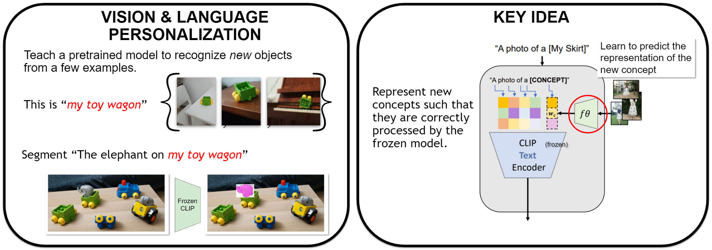

<p align="center"></p>

# PerVL Benchmark


This reporsitory contains the annotations and scripts for the PerVL benchmarks reported in the paper 

> "This is my unicorn, Fluffy": Personalizing frozen vision-language representations , *Niv Cohen, Rinon Gal, Eli A. Meirom, Gal Chechik, Yuval Atzmon*, ECCV 2022 (Oral)

## Setup
1. Make sure you have miniconda or anaconda installed
2. Install and activate the project conda environment
```
conda env create --file ./environment.yaml
conda activate palavra
pip install git+https://github.com/openai/CLIP.git
```

## Prepare the data
### PerVL-YTVOS
1. Get the Youtube-VOS data from its official website: https://youtube-vos.org/dataset/vos/ (2019 version)
2. Put the train.zip under the directory data/youtube_vos and unzip
3. Prepare YTVOS initial directory structure: 
```
cd ytvos
python prepare_YTVOS_initial_directory_structure.py
python ytvos_read_split.py
```


### PerVL-DeepFashion2
1. Get the DeepFashion2 train data from its official website: https://github.com/switchablenorms/DeepFashion2
2. Put the train.zip filer under the directory data/deep_fashion2 and unzip
3. Prepare deep_fashion initial directory structure: <br> 
```
cd deep_fashion
python prepare_deep_fashion2_initial_directory_structure.py
```

### Data for training an inversion model
1. Download the parsed caption file from this project:
<br> https://github.com/yuvalatzmon/compositional-relationships-data/blob/master/mscoco-train2014-svo-2016-02-18.txt <br>
and save under the directory:
`data/inversion_model_train_data`
2. Parse the ms-coco annotation file to choose the top common classes:
```
cd inversion_training
python parse_mscoco_txt.py
```

 
4. Download ms-coco 2014 train set from here: https://cocodataset.org/#download
and unzip it to under `data/inversion_model_train_data`

5. Extract visual features using the CLIP network: <br>
```
cd inversion_training
python get_visual_features.py
```

6. Download open-images class names from: <br>
https://storage.googleapis.com/openimages/v6/oidv6-class-descriptions.csv <br>
and save under the directory:
`data/inversion_model_train_data`
7. Find matches between chosen ms-coco classes and open-images class names by running: <br>
`python text_from_open_images.py`

## Directory Structure
directory | file | description
---|---|---
`annotations/` | * | CSV and YAML files with the split and annotation we prepared for PerVL-DeepFashion2 and PerVL-YTVOS. 
`deep_fashion/` | * | Scripts to create a folder strucutre for the deep_fashion2 benchmark
`ytvos/` | * | Scripts to create a folder strucutre for the youtube-vos benchmark
`inversion_training/` | * | Scripts to preprocess ms-coco data for training an inversion module


## License and attribution

Copyright (C) 2022 NVIDIA Corporation. All rights reserved.

The benchmark and annotations are made available under the [CC-BY-NC-SA-4.0](https://creativecommons.org/licenses/by-nc-sa/4.0/). If you remix, transform, or build upon the material, you must distribute your contributions under the same license as the original. To view a copy of this license, visit the LICENSE file in this repository root.

For license information regarding the DeepFashion2 dataset and its annotations, please refer to the [official website](https://github.com/switchablenorms/DeepFashion2).

YouTube-VOS dataset **annotations** were released under [CC-BY-4.0](https://creativecommons.org/licenses/by/4.0/). For license information regarding the YouTube-VOS dataset and its annotations, please refer to the [official website](https://youtube-vos.org).

COCO dataset **annotations** were released under [CC-BY-4.0](https://creativecommons.org/licenses/by/4.0/). For license information regarding the COCO dataset and its annotations, please refer to the [official website](https://cocodataset.org).

compositional-relationships-data were released under [CC-BY-4.0](https://creativecommons.org/licenses/by/4.0/).  For license information regarding the compositional-relationships-data repository, please refer to the [official website](https://github.com/yuvalatzmon/compositional-relationships-data).

OpenImages **annotations** were released under [CC-BY-4.0](https://creativecommons.org/licenses/by/4.0/). For license information regarding OpenImages dataset, please refer to the [official website](https://storage.googleapis.com/openimages/web/factsfigures.html). 

## Cite the paper
If you use the contents of this project, please cite our paper.

    @inproceedings{eccv2022_palavra_cohen,
     author = {Cohen, Niv and Gal, Rinon and Meirom, Eli A. and Chechik, Gal and Atzmon, Yuval},
     booktitle = {European Conference on Computer Vision (ECCV) },
     title = {"This is my unicorn, Fluffy": Personalizing frozen vision-language representations},
     year = {2022}
    }

For business inquiries, please contact [researchinquiries@nvidia.com](researchinquiries@nvidia.com) <br>
For press and other inquiries, please contact Hector Marinez at [hmarinez@nvidia.com](hmarinez@nvidia.com)
